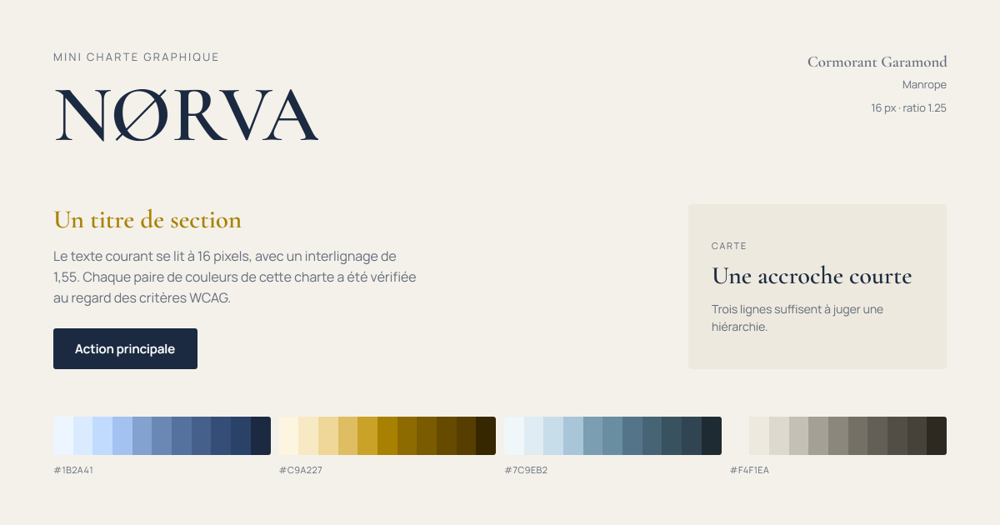

# Gamme

**Générateur de mini charte graphique.** Quatre couleurs, deux polices, et la
charte complète en quelques secondes.

Gratuit, sans compte, sans serveur : tout se calcule dans votre navigateur, et
rien de ce que vous saisissez ne le quitte.

**[→ Ouvrir l'outil](https://gamme-murex.vercel.app)** · [À propos](https://gamme-murex.vercel.app/a-propos)



---

## Ce que ça fait

Vous entrez jusqu'à quatre couleurs et deux polices. L'outil en déduit :

**Les nuances.** Onze paliers par couleur, de 50 à 950, calculés en OKLCH. La
couleur que vous avez saisie est restituée telle quelle sur le palier dont la
clarté est la plus proche — vous devez retrouver *votre* couleur dans la rampe.
Aucun palier ne sort du gamut sRGB.

**La matrice de contrastes.** Toutes les paires texte/fond, plus le blanc et le
noir. Ratio WCAG 2.1 et verdict AA / AAA, pour le texte courant comme pour le
grand texte. Et pour chaque paire qui échoue, la nuance la plus proche — même
teinte — qui atteint AA : un clic remplace la couleur dans votre charte.

**L'échelle typographique.** Rendue avec vos polices. Taille de base et ratio
réglables, avec l'interlignage conseillé à chaque niveau — il se resserre quand
la taille augmente, parce qu'un titre de 48 px avec l'interlignage d'un
paragraphe se désagrège en lignes flottantes.

**Le brand board.** Le visuel de synthèse, en 1200 × 630 pour les aperçus de
lien et en 1080 × 1350 pour un post. Exporté en PNG à deux fois la définition,
polices comprises.

**Les exports.** Variables CSS, bloc `@theme` pour Tailwind v4, tokens JSON au
format W3C Design Tokens. À copier ou à télécharger.

**Une URL partageable.** Toute la configuration tient dans le fragment de
l'URL — la partie après le `#`, qui n'est jamais transmise au serveur. Même
l'hébergeur ne voit pas votre charte.

## Quelques partis pris

- **Le ratio affiché est tronqué, pas arrondi.** Arrondir 4,4996 donnerait
  « 4,50 » sur une paire en échec : soit un affichage qui contredit son propre
  verdict, soit un faux succès. La troncature garantit qu'ils racontent toujours
  la même chose.
- **La luminance WCAG n'est pas la clarté OKLCH.** Les deux sont calculées
  séparément ; les confondre donnerait de faux verdicts.
- **Le brand board applique à lui-même la règle qu'il enseigne.** Si une couleur
  de marque est illisible sur le fond du visuel, c'est la nuance la plus proche
  qui passe AA qui est employée. Les couleurs exactes restent dans la bande de
  palette, en bas.
- **L'interface ne vole pas la vedette aux palettes.** Papier, encre, filets
  d'un cheveu, un seul accent. Toutes ses couleurs de texte passent AAA : un
  outil qui juge le contraste des autres n'a pas le droit d'échouer au sien.

## Accessibilité

C'est un outil qui parle d'accessibilité ; il est tenu d'être exemplaire.

| Contrôle | Résultat |
|---|---|
| Lighthouse mobile | 98 · 100 · 100 · 100 |
| axe-core, trois états | 0 violation |
| Tests unitaires | 151 |
| Vérifications de bout en bout | 83 |

Navigation clavier complète — combobox ARIA, onglets aux flèches, anneau de
focus visible partout. Un label par champ, les résultats annoncés en
`aria-live` avec un délai pour ne pas réciter la matrice à chaque frappe, et
`prefers-reduced-motion` respecté.

Les calculs de contraste sont vérifiés contre
[WebAIM Contrast Checker](https://webaim.org/resources/contrastchecker/) :
correspondance exacte sur cinq paires, ratios et verdicts.

## La stack

| | |
|---|---|
| [Vite](https://vite.dev) | build |
| [React](https://react.dev) + [TypeScript](https://www.typescriptlang.org) | interface |
| [Tailwind CSS v4](https://tailwindcss.com) | styles |
| [culori](https://culorijs.org) | conversions et gamut mapping |
| [html-to-image](https://github.com/bubkoo/html-to-image) | export PNG |

Deux dépendances de production, en tout. Pas de serveur, pas de base de données,
pas de clé d'API — le catalogue de 171 Google Fonts est embarqué dans le dépôt
et les familles se chargent à la demande via l'URL `css2`.

### Architecture

```
src/
├─ lib/          le moteur de calcul : TypeScript pur, ni React ni DOM
│  ├─ color/     parsing, échelles OKLCH, contrastes WCAG, suggestions
│  ├─ typography/ échelle modulaire et interlignage
│  ├─ share/     encodage et décodage de l'URL
│  └─ export/    CSS, Tailwind, DTCG, PNG
├─ data/         le catalogue de polices
├─ state/        la configuration, source unique de vérité
└─ components/   la couche de rendu
```

`src/lib/` ne dépend de rien d'autre que `culori` : tout s'y teste sans
navigateur. L'interface n'est qu'une couche posée au-dessus.

## Lancer en local

```bash
git clone https://github.com/Voxx45/gamme.git
cd gamme
npm install
npm run dev
```

| Commande | Ce qu'elle fait |
|---|---|
| `npm run dev` | serveur de développement |
| `npm run build` | vérification TypeScript puis build de production |
| `npm run preview` | sert le build de production |
| `npm test` | les 151 tests unitaires |
| `npm run lint` | oxlint |
| `npm run e2e` | partage, exports et PNG, avec Playwright |
| `npm run qa` | axe-core, parcours clavier, cas limites |
| `npm run lighthouse` | Lighthouse en profil mobile |
| `npm run captures` | les captures d'écran du dépôt |
| `npm run assets` | l'image Open Graph et les icônes |
| `npm run demo` | rejoue la charte NØRVA dans le terminal |

Les scripts de vérification ont besoin d'un serveur : lancez
`npm run build && npm run preview` d'abord, puis passez l'URL par la variable
`BASE` si vous n'utilisez pas le port par défaut.

## Licence

[MIT](LICENSE) — faites-en ce que vous voulez.

Les polices proposées viennent de [Google Fonts](https://fonts.google.com) et
restent sous leurs licences respectives, principalement l'OFL. L'outil ne les
redistribue pas : il les charge depuis Google au moment où vous les choisissez.
Cela implique une requête vers les serveurs de Google, donc le partage de votre
adresse IP avec eux. Aucun cookie n'est posé, et l'outil ne mesure rien.

## Crédits

Conçu et développé par **[Ewan Pineau](https://pineauewan.com)**, designer
graphique et web, en recherche d'alternance.

Le dépôt contient un [journal de fabrication](JOURNAL.md) qui retrace chaque
étape : les décisions prises, les problèmes rencontrés, et les erreurs
corrigées en chemin. Il est plus instructif que ce README.
